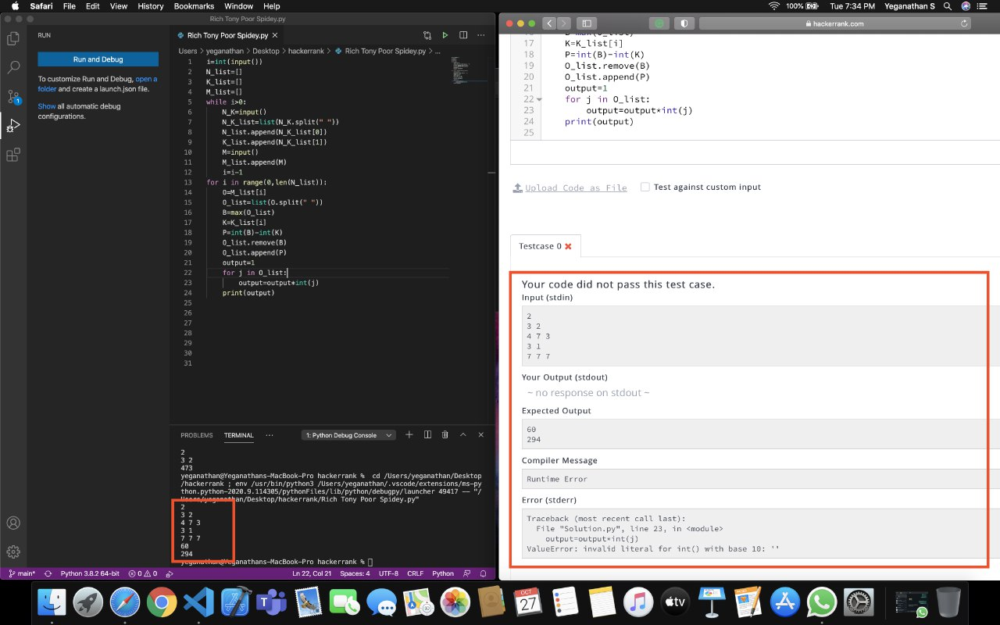
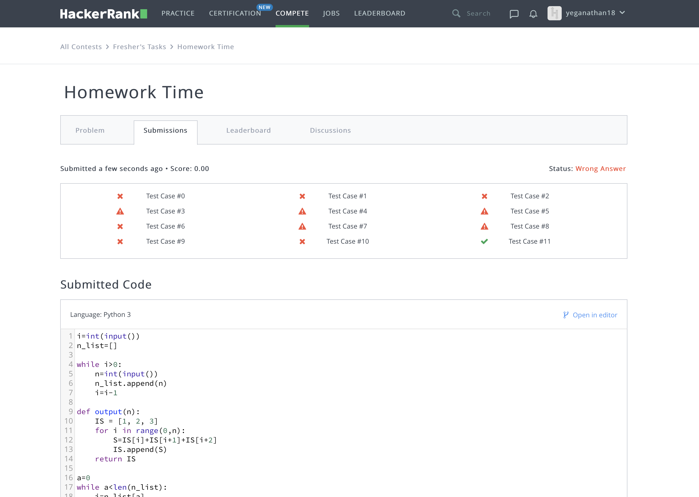

## task - 3 ##

I'm new to Competitive Programming and These tasks was really challenging, took hours for completing atleast for me.I had some previous experience in Python as it was a part of my syllabus in high school and also i have pretty basic knowledge in C++ too. Since I was familiar with both Python and C++ i used them to solve these sub tasks. I successfully finished all the sub tasks though some were ended up in tragedy as i couldn't complete the all tasks with maximum points.Hope i would do better in Future!

###### HackerRank username: **yeganathan18**

### In Some tasks i'm getting the output in Editor and not in the hacker rank ###
**Here is an example below, do check it out** 

### And in few problems i could only pass the Sample test case not more than that! ###

