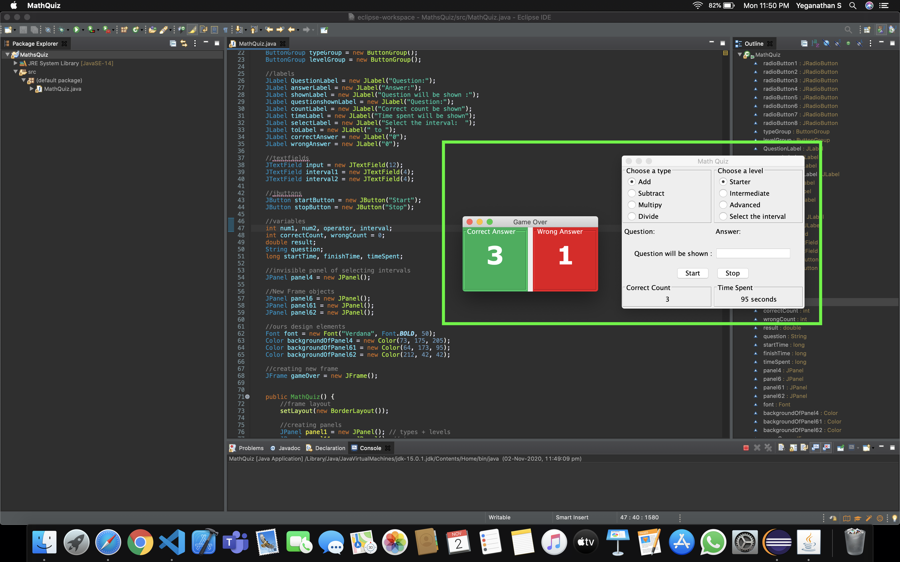

## task - 4

**Since I don't know Java at present(though i will learn it in future!) somehow i was able to solve errors using some pretty common sense and programming knowledge that i had before with other languages, i could able to complete it fully and make the app work. It was really fun to debug :)**

## MathsQuiz App Works perfeclty!

**Ps: Tbh i thought Java would be pretty hard and as said before myself no experience in java and i just wanted to give it a shot. Guess what, i nailed it! XD**

