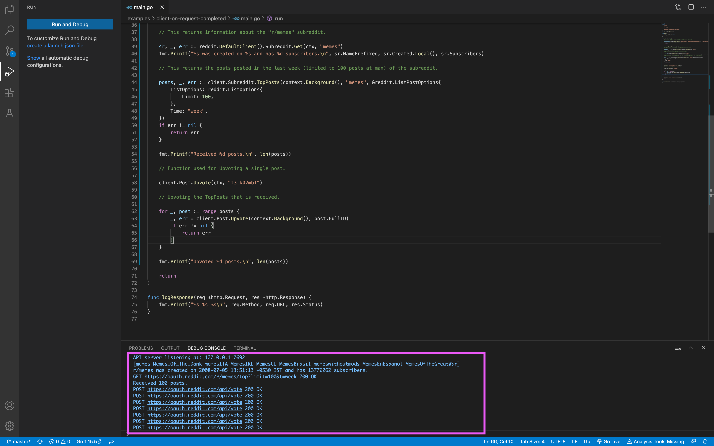

## task - 6

### Done:

* Performed a search for subreddits using ‘memes’ as the search query.

* Picked the subreddit that occurs as the first search result.

* Using that, successfully upvoted posts posted in the last week (limited to 100 posts at max) 

***Ps: It was difficult to upvote the TopPost that is received but atlast figured it out with the help of few google searches and refering stack overflow***