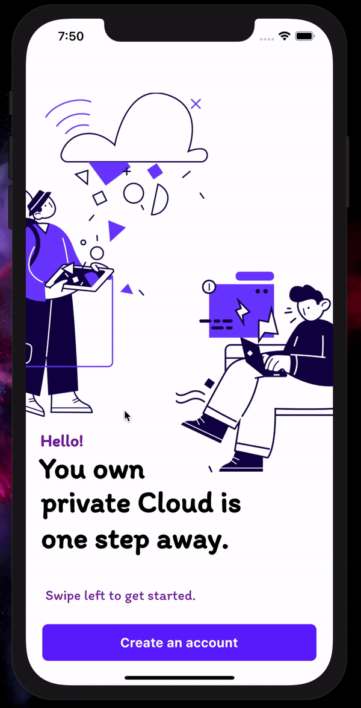

## task - 7

I Made an Simple User Interface using Flutter! and This is one of my favourite task too.

## Sneak peek of my UI ^_^

**Ps: I didn't use the dots_indicator package which helps making the dot animated when changing tabs, Tbh i tried implementing it but unfortunately i couldn't.**
