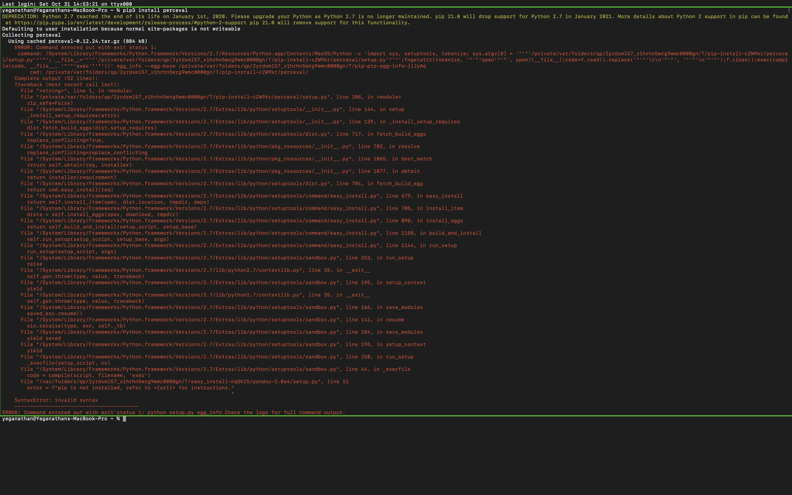
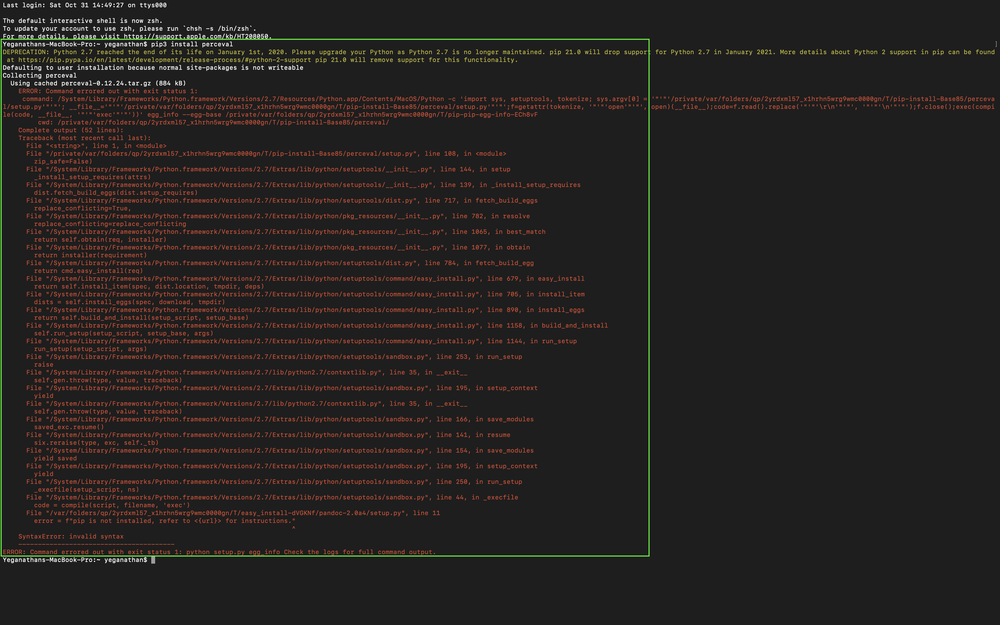
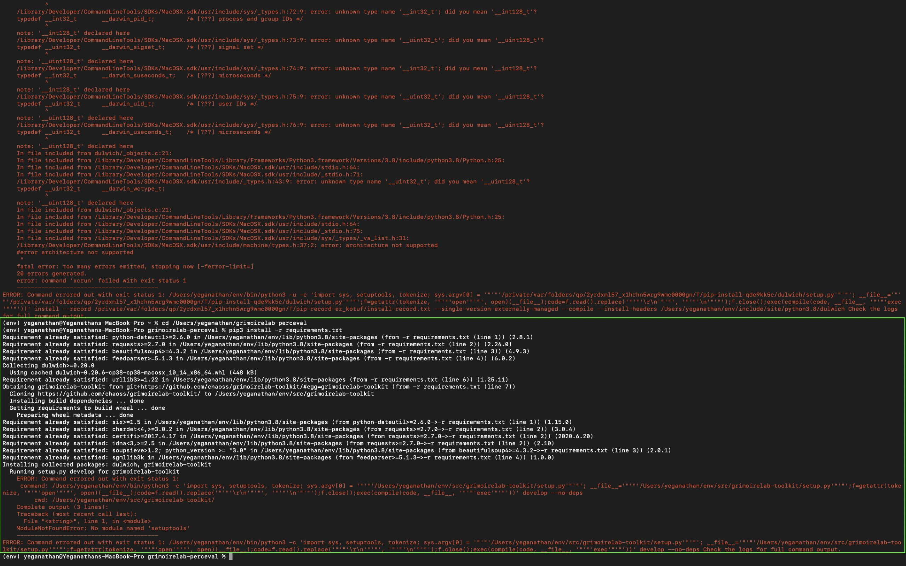

## task - 8 (Skipped this task as adviced by my senior due to the following issues) ##

**I tried installing perceval through terminal many ways, since myself using macOS not compatible it seems. So i couldn't complete the given task, also i have attached the screenshot below of the errors faced during installation.**

### 1.Installation throught zsh shell. ###

### 2.Installation throught bash shell. ###

### 3.Installation by git cloning and also tried installation through venv too! ###

