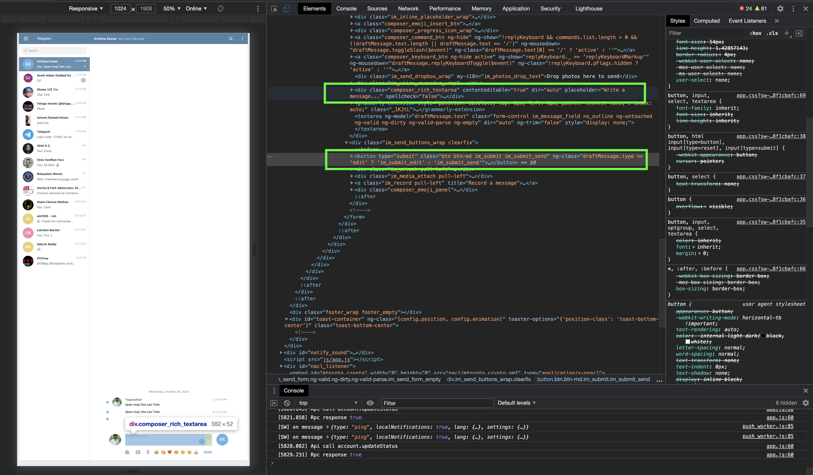
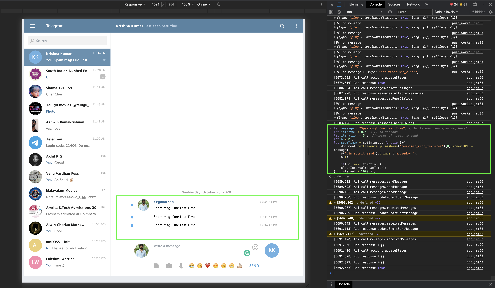

## task - 9

**Got the required Element's Class using the Developer Tools in chrome! please refer the screenshot attached below :)**

**Wrote a script that Spams our lazy friend with lots of 'Hi' messages on the telegram web using JavaScript**

***Ps: I have attached the screenshot of my custom spam message (never mind!) , you can always edit the message you need to send in the script.***
